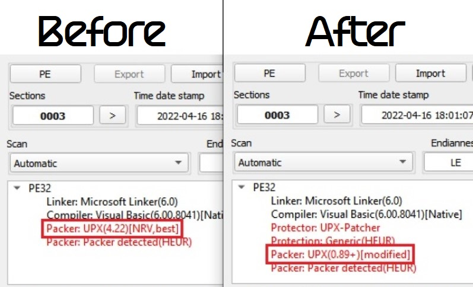
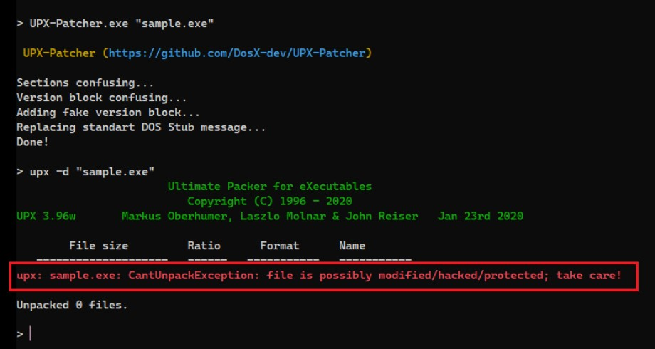

## 🦾 UPX-Patcher (EXE/DLL)
[UPX](https://upx.github.io/) is a free, secure, portable, extendable, high-performance executable packer for several executable formats. But it can also decompress its own stubs. **So make `upx -d` unpacking impossible!**

Using:
```cmd
UPX-Patcher.exe "sample.exe"
```

> Patched file in [Detect It Easy](https://github.com/horsicq/Detect-It-Easy)


> Demonstration
